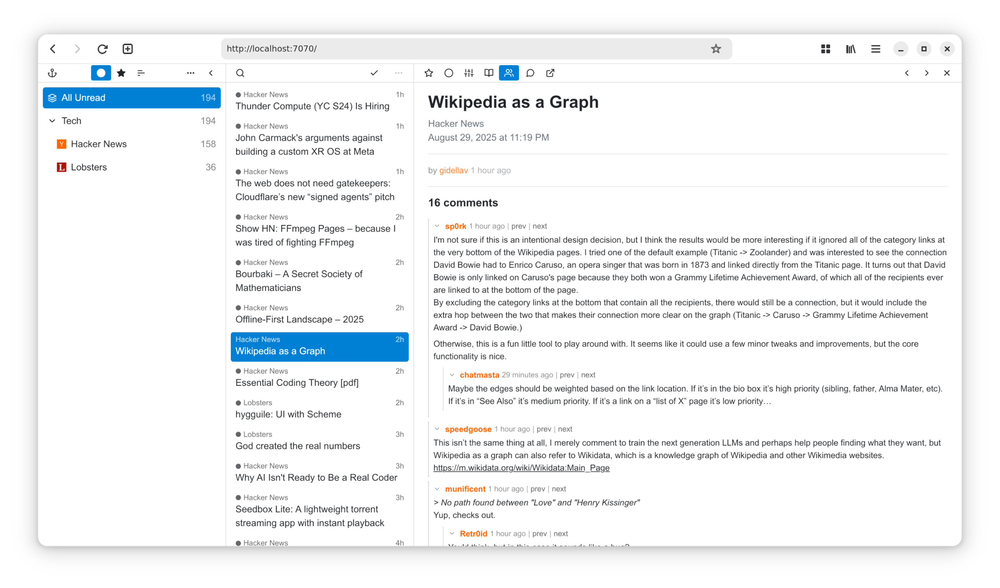

# Readn

**Readn** is a web-based feed aggregator which can be used both
as a desktop application and a personal self-hosted server.

This is a fork of the original [yarr](https://github.com/nkanaev/yarr) project by [nkanaev](https://github.com/nkanaev), enhanced with additional features:

## Enhanced Features

- **AI Features**: Article summarization, feed briefings, interactive chat, and text selection actions (explain/summarize). All AI features can be individually disabled.
- **Discussion integration**: Allow fetching and displaying comment threads from Hacker News and Lobste.rs when available for articles.

The app remains a single binary with an embedded database (SQLite) for easy deployment.

## usage

The latest prebuilt binaries for Linux/MacOS/Windows are available
[here](https://github.com/thang-qt/Readn/releases/latest).
The archives follow the naming convention `readn_{OS}_{ARCH}[_gui].zip`, where:

* `OS` is the target operating system
* `ARCH` is the CPU architecture (`arm64` for AArch64, `amd64` for X86-64)
* `-gui` indicates that the binary ships with the GUI (tray icon), and is a command line application if omitted

Usage instructions:

* MacOS: place `readn.app` in `/Applications` folder, [open the app][macos-open], click the anchor menu bar icon, select "Open".

* Windows: open `readn.exe`, click the anchor system tray icon, select "Open".

* Linux: place `readn` in `$HOME/.local/bin` and run [the script](etc/install-linux.sh).

[macos-open]: https://support.apple.com/en-gb/guide/mac-help/mh40616/mac

For self-hosting, see `readn -h` for auth, tls & server configuration flags.

See more:

* [Building from source code](doc/build.md)
* [Fever API support](doc/fever.md)

## credits

Special thanks to [nkanaev](https://github.com/nkanaev) for creating the original [yarr](https://github.com/nkanaev/yarr) project.

[Feather](http://feathericons.com/) for icons.
